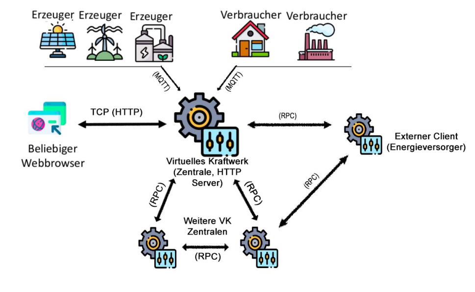

# SS21 - Verteilte Systeme 
### **Maintainer** Aytunc Yilmaz 743831
### **Maintainer** Jusuf Jusufovic 755481
 
A university project for a virtual power plant, which has as a learning objective, the management by communication protocols "http, udp, tcp". 
   

## **Motivation**

This project is a practice project for the distributed systems module at Darmstadt University of Applied Sciences. 
   

**ProjectDesign**
- 

**Install Docker Desktop**
- `https://www.docker.com/products/docker-desktop`
   

**How to start containers with Docker | -d to be able to continue using the command line**
- `docker-compose up | docker-compose up -d`
   

**How to shutdown containers with Docker | -d to be able to continue using the command line**
- `docker-compose down | docker-compose down -d`
   

**Use our run.sh to start compiling**
   

**If any problems with our run.sh you can use the commands below**
   

**How to run our thrift server with Docker | -d to be able to continue using the command line**
- `docker run -v "$PWD/common-code/src/main/thrift:/data" thrift thrift -o /data --gen java /data/status.thrift`
- `docker run -v "$PWD/common-code/src/main/thrift:/data" thrift thrift -o /data --gen java /data/componentController.thrift`
   

**How to build our central, client, components with Docker | -d to be able to continue using the command line**
- `docker build --pull --rm -f "central/Dockerfile" -t central .`
- `docker build --pull --rm -f "component/Dockerfile" -t component .`
- `docker build --pull --rm -f "client/Dockerfile" -t client .`
   

**How to attach our external client on docker**
- `docker attach client`
   

**How to use our attached client on docker**
- `status` = *shows status of used energie*
- `history 1` = *prints history of used energie*
- `history 2` = *prints history of used energie*
- `history 3` = *prints history of used energie*
- `stop` = *stops external client*
   

**Use our HTTP Site**
- `localhost:1234/ausgabe`

## **License**
- MIT